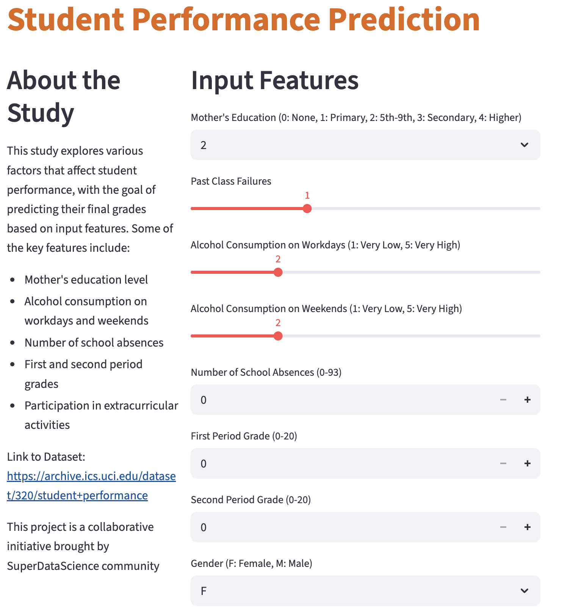

# 🎓 Student Performance Prediction – Regression Models

##  Project Overview
This project analyzes the Student Performance Dataset from the **UCI Machine Learning Repository** to predict final student grades (G3) based on demographic, social, and academic features.
The workflow includes **exploratory data analysis (EDA)**, preprocessing, and training of **multiple regression models (Linear Regression, Random Forest, and XGBoost)**. The goal is to identify the most important factors that influence academic success and to benchmark different modeling approaches.

For demonstration purposes, a prototype **Streamlit app** was built using the Random Forest Regressor. The app allows users to explore model predictions interactively and illustrates how the solution could be deployed in practice.

## 🔹 Dataset
- **Source**: UCI Machine Learning Repository – Student Performance Dataset  
- **Size**: 395 students, 33 features  
- **Target Variable**: `G3` (final grade, 0–20)  

Features include demographic data (age, gender, address), social factors (family, relationships), and academic history (study time, absences, past grades).

## 🔹 Models Used
- **Linear Regression** → Baseline model  
- **Random Forest Regressor** → Non-linear ensemble model  
- **XGBoost Regressor** → Gradient boosting, state-of-the-art  

## 🔹 Evaluation Metrics
- **MAE (Mean Absolute Error)** → average prediction error  
- **RMSE (Root Mean Squared Error)** → penalizes large errors  
- **R² (Coefficient of Determination)** → explained variance  

##  Results
| Model              | MAE ↓    | RMSE ↓   | R² ↑     |
|--------------------|----------|----------|----------|
| Linear Regression  | 1.646666 | 2.378370 | 0.724134 |
| Random Forest      | 1.190696 | 1.983077 | 0.808213 |
| XGBoost            | 1.223413 | 2.081294 | 0.788745 |

- **RandomForest achieved the best performance**, outperforming Linear Regression and XGBoost.  
- The most important predictors were **early grades (G1, G2)**, **study time**, and **absences**.  

##  Key Insights
- Early academic performance is highly predictive of final success.  
- Consistent study time and low absences are strong indicators of good performance.  
- Machine learning models can help identify at-risk students early.  

##  Next Steps
- Perform hyperparameter tuning (GridSearchCV or Optuna) for further improvements.  
- Try probabilistic models such as **NGBoost** to quantify prediction uncertainty.  

---

 **Author**: Cholpon Zhakshylykova 
 **Repository**: Student Performance Prediction  
 📧 Contact: zhakshylykova@gmail.com 